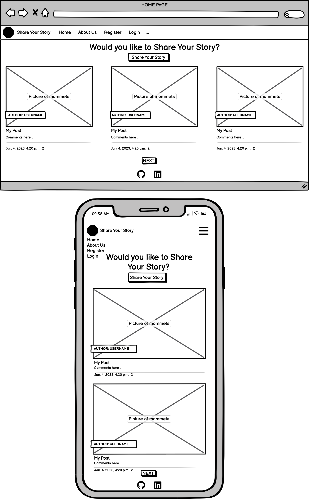

# Share Your Story

## Introduction
 The Share Your Story blog is a website about people's travels among people who want to read about their guides and experiences in so many places. The website is aimed at people who are adventurous and who want to know interesting places. The Share Your Story will be useful as a reference for those who are looking for travel information and also for people who want to share their reviews on posts. 

[View the live Website on Github Pages](https://sharestories.herokuapp.com/) Please note: To open any links in this document in a new browser tab, please press CTRL + Click.

## Table Of Contents:
- [User Experience (UX)](#user-experience-ux)
  - [Project Aims](#project-aims)
  - [User Stories](#user-stories)
  - [Agile Methodology](#agile-methodology)
  - [Design](#design)
    - [Wireframes](#wireframes)
    - [Colour Scheme](#colour-scheme)
    - [Typography](#typography)
    - [Database Schema](#database-schema)
- [Features](#features)
  - [Features Not Implemented](#features-not-implemented)
  - [Future Features](#future-features)
- [Technologies Used](#technologies-used)
  - [Languages Used](#languages-used)
  - [Python Modules and Packages/Frameworks Used](#python-modules-and-packagesframeworks-used)
  - [Programs and Tools Used](#programs-and-tools-used)
- [Testing](#testing)
  - [Bugs](#bugs)
    - [Fixed Bugs](#fixed-bugs)
- [Deployment](#deployment)
  - [Forking the GitHub Repository](#forking-the-github-repository)
  - [Deploying with Heroku](#deploying-with-heroku)
- [Credits](#credits)
  - [Online resources](#online-resources)
  - [Media](#media)
  - [Acknowledgments](#acknowledgments)

## User Experience (UX)

### Project Aims
* The goals of the project are to share stories and places about travel. It aims to reach users who want to share their feedback and share their stories in the feature future.

### User Stories

#### View post list
* As a Site User, I can view a list of posts so that I can select one to read.

#### Open a post
* As a Site User I can click on a post so that I can read the full text.

#### View Likes
* As a Site User / Admin I can **view the number of likes on each post so that I can see which is the most popular or viral.

#### View Comments
* As a Site User / Admin I can view comments on an individual post so that I can read the conversation.

#### Account Registration
* As a Site User I can register an account so that I can comment and like.

#### Comment on a post
* As a Site User I can leave comments on a post so that I can be involved in the conversation.

#### Like / Unlike
* As a Site User I can like or unlike a post so that I can interact with the content.

#### Approve comments
* As a Site Admin I can approve or disapprove comments so that I can filter out objectionable comments.

#### Account Login
* As a Site User I can login to my account so that I can use the Website using my existing credentials.

#### Account Logout
* As a Site User I can logout of my account so that I can keep my account secure on shared devices.

#### Edit Comment
* As a Site User I can edit comments so that I can update my comments.

#### Delete Comment
* As a Site User, I can delete comments so that I can remove all the information about my comment.

#### Site Pagination
* As a Site User, I can view a paginated list of posts so that easily select a post to view.

### Agile Methodology

All user stories were entered as issues in a GitHub Kanban project and assigned labels using the MoSCoW prioritization technique. The live project board can be found on the repository's project tab or on the following link:

[User Experience BOARD](https://github.com/users/llancruzz/projects/8)

Pull requests were linked with a user story when they contributed to the completion of the acceptance criteria.

### Design

#### Wireframes

I created Wireframes to visualize the site's design and act as a template to use when developing the templates. When designing the site I wanted to ensure the site looked and functioned just as well on mobile as larger viewports. Users may use phones as their primary device to raise and view requests and this also offers flexibility to support staff to work from any device.

Home Page Wireframe

 

#### Colour Scheme

#### Typography

Google fonts were used in this project with both fonts selected for their legibility and simplicity.

#### Images and Iconography

The icon (as with all others on the site) is from [Font Awesome](https://fontawesome.com/).

The favicon was created from an image found on [favicon](https://favicon.io/) and was used to match the logo icon of the blog.

#### Database Schema

Two custom models were created based on the initial database schema design as below. The CustomUser model was created first as this extended the AbstractUser class to allow roles to be added. The Post and Comment models were then created in turn as required by the user stories.

## Features
Content

### Features Not Implemented

1. Managing Teams and Ticket Categories

    - Content

### Future Features

- Knowledge base
  - Content

## Technologies Used

### Languages Used

- HTML5
- CSS3
- Python
- Javascript

### Python Modules and Packages/Frameworks Used

- Built-in Packages/Modules
  - [smtplib](https://docs.python.org/3/library/smtplib.html#smtplib.SMTPException) - Used to import SMTPException used when catching errors sending emails.
  - [datetime](https://docs.python.org/3/library/datetime.html) - Used to get current time in a timezone aware format to use when updating tickets.
  - [os](https://docs.python.org/3/library/os.html) - This module provides a portable way of using operating system dependent functionality.

- External Python Packages
  - [cloudinary](https://pypi.org/project/cloudinary/1.29.0/) - Used for the Ticket Image Model field, Image upload and deletion.
  - [crispy-bootstrap5](https://pypi.org/project/crispy-bootstrap5/0.6/) - Used to style form using Bootstrap5
  - [dj-database-url](https://pypi.org/project/dj-database-url/0.5.0/) - Allows the use of 'DATABASE_URL' environmental variable in the Django project settings file to connect to a PostgreSQL database.
  - [dj3-cloudinary-storage](https://pypi.org/project/dj3-cloudinary-storage/0.0.6/) - Facilitates integration with Cloudinary by implementing Django Storage API.
  - [Django](https://pypi.org/project/Django/3.2.14/) - High-level Python Web framework used to develop the project
  - [django-allauth](https://pypi.org/project/django-allauth/0.51.0/) - Set of Django application used for account registration, management and authentication.
  - [django-crispy-forms](https://pypi.org/project/django-crispy-forms/1.14.0/) - Used to format form elements and layout.
  - [django-filter](https://pypi.org/project/django-filter/22.1/) - Application that allows dynamic QuerySet filtering from URL parameters.
  - [django-model-utils](https://pypi.org/project/django-model-utils/) - Easily add choices to a django model field.
  - [django-summernote](https://pypi.org/project/django-summernote/0.8.20.0/) - Allows easy use of the Summernote WYSIWYG editor in Django projects.
  - [gunicorn](https://pypi.org/project/gunicorn/20.1.0/) - Python WSGI HTTP Server
  - [Pillow](https://pypi.org/project/Pillow/9.2.0/) - Fork of PIL, the Python Imaging Library which provides image processing capabilities.
  - [psycopg2](https://pypi.org/project/psycopg2/2.9.3/) - Python PostgreSQL database adapter

### Programs and Tools Used

- [Google Fonts:](https://fonts.google.com/)
  - Google fonts import statements were used as part of this project to make use
    of the Poppins and Cabin Round fonts which are used on all pages of the
    website.
- [Bootstrap](https://getbootstrap.com/)
  - Bootstrap was used through the project to style the project and create responsive elements/layouts.
- [drawSQL](https://drawsql.app/) - Create Database Schema/ERD
- [Git](https://git-scm.com/)
  - Git was used for version control, using the terminal to commit to Git and
    Push to GitHub.
- [GitHub:](https://github.com/)
  - GitHub is used to store the projects code after being pushed from Git.
- [GIMP:](https://www.gimp.org/)
  - GIMP was used to edit and resize photos for the readme.
- [Balsamiq:](https://balsamiq.com/)
  - Balsamiq was used to create the [wireframes](#wireframes) during the design
    process.
- [Coolors](https://coolors.co/image-recolor)
  - Coolors Artwork Recolor was used to alter the hero images colours.
- [TinyJPG](https://tinyjpg.com/)
  - Used to compress images for the README.
  - [flake8](https://github.com/pycqa/flake8) - Code Linter
  - [black](https://github.com/psf/black) - Code Formatter

## Testing

Content

### Bugs

Content

#### Fixed Bugs

Content

## Deployment

### Forking the GitHub Repository

By forking the GitHub Repository we make a copy of the original repository on
our GitHub account to view and/or make changes without affecting the original
repository by using the following steps...

1. Log in to GitHub and locate the [GitHub
   Repository](#)
1. At the top of the Repository (not top of page) just above the "Settings"
   Button on the menu, locate the "Fork" Button.
1. Click the button (not the number to the right) and you should now have a copy
   of the original repository in your GitHub account.

### Deploying with Heroku

## Credits

### Online resources

- [Django Documentation](https://docs.djangoproject.com/en/3.2/)
- [Bootstrap Documentation](https://getbootstrap.com/docs/5.1) and [Examples](https://getbootstrap.com/docs/5.1/examples/)
- [Django-Summernote Documentation](https://github.com/summernote/django-summernote)
- [Pillow Documentation](https://pillow.readthedocs.io/en/stable/)

### Media

Content

### Acknowledgments

Content

