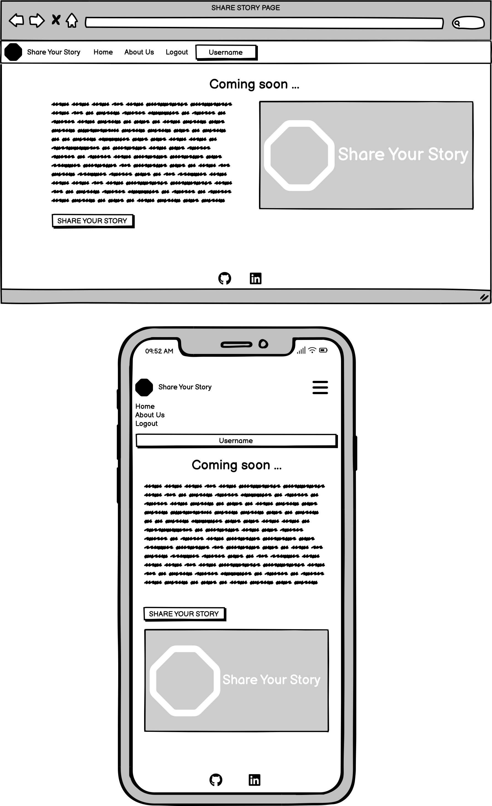
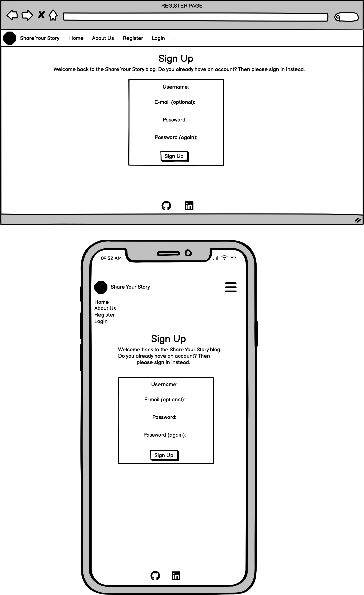
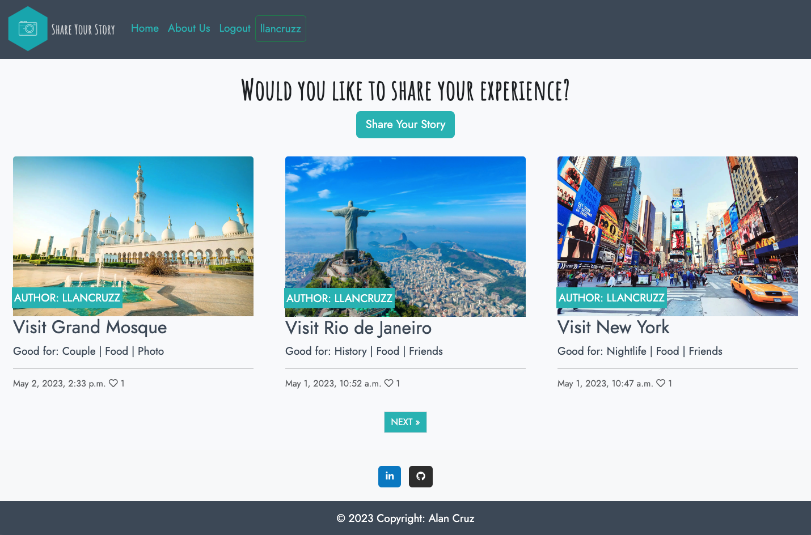
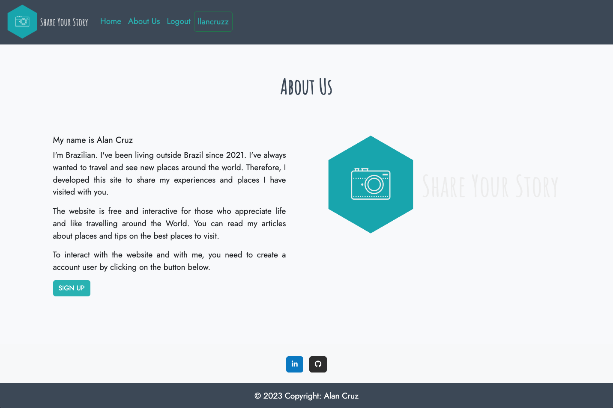
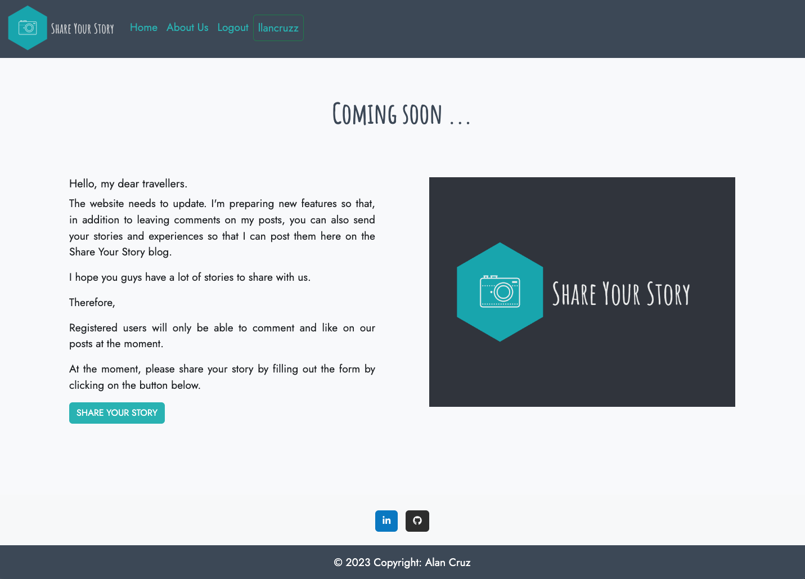
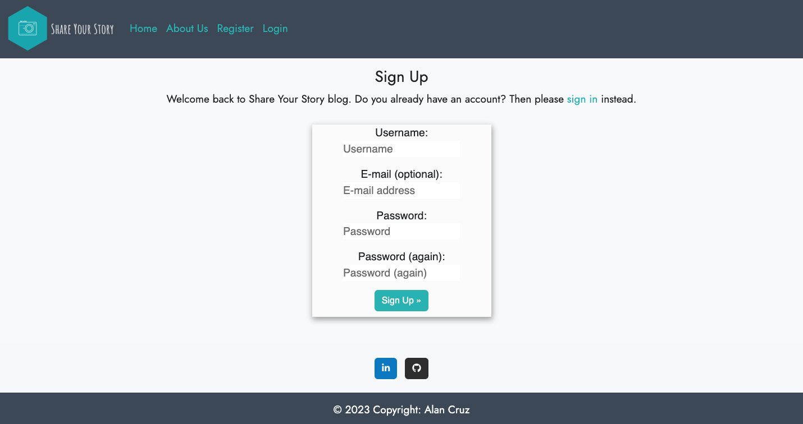
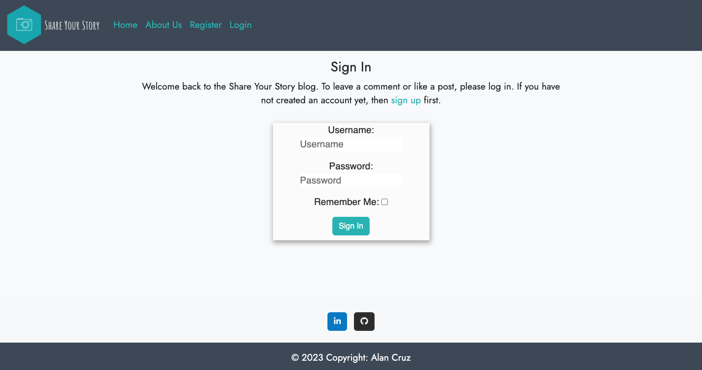
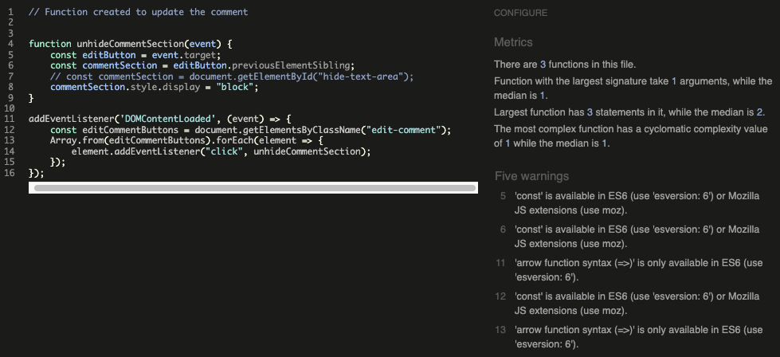
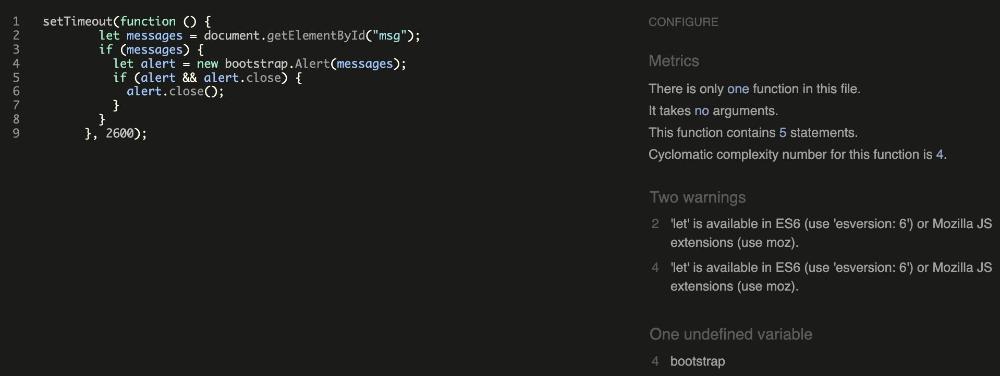
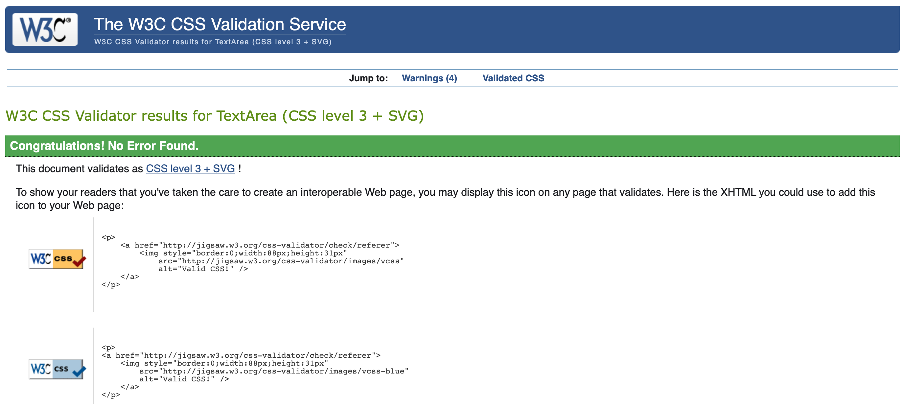

# Share Your Story


## Introduction
 The Share Your Story blog is a website about people's travels among people who want to read about their guides and experiences in so many places. The website is aimed at people who are adventurous and who want to know interesting places. The Share Your Story will be useful as a reference for those who are looking for travel information and also for people who want to share their reviews on posts. This is the 4th portfolio project developed as part of the Code Institute Diploma in Full Stack Development. It was created to demonstrate skills acquired using Django to design and develop websites that offer full CRUD (create, read, update and delete) functionality.


[View the live Website on Github Pages](https://sharestories.herokuapp.com/) Please note: To open any links in this document in a new browser tab, please press CTRL + Click.

## Table Of Contents:
- [User Experience (UX)](#user-experience-ux)
  - [Project Aims](#project-aims)
  - [User Stories](#user-stories)
  - [Agile Methodology](#agile-methodology)
  - [Design](#design)
    - [Wireframes](#wireframes)
    - [Colour Scheme](#colour-scheme)
    - [Typography](#typography)
    - [Database Schema](#database-schema)
- [Features](#features)
  - [Features Not Implemented](#features-not-implemented)
  - [Future Features](#future-features)
- [Technologies Used](#technologies-used)
  - [Languages Used](#languages-used)
  - [Python Modules and Packages/Frameworks Used](#python-modules-and-packagesframeworks-used)
  - [Programs and Tools Used](#programs-and-tools-used)
- [Testing](#testing)
  - [Python](#python)
  - [JavaScript](#javascript)
  - [CSS](#css)
  - [Bugs](#bugs)
    - [Fixed Bugs](#fixed-bugs)
- [Deployment](#deployment)
  - [Create database with EleephantSQL.com](#create-database-with-eleephantsqlcom)
  - [Deploying with Heroku](#deploying-with-heroku)
  - [Forking the GitHub Repository](#forking-the-github-repository)

- [Credits](#credits)
  - [Online resources](#online-resources)
  - [Media](#media)
  - [Acknowledgments](#acknowledgments)

## User Experience (UX)

### Project Aims
* The goals of the project are to share stories and places about travel. It aims to reach users who want to share their feedback and share their stories in the feature future.

### User Stories

#### View post list
* As a Site User, I can view a list of posts so that I can select one to read.

#### Open a post
* As a Site User I can click on a post so that I can read the full text.

#### View Likes
* As a Site User / Admin I can **view the number of likes on each post so that I can see which is the most popular or viral.

#### View Comments
* As a Site User / Admin I can view comments on an individual post so that I can read the conversation.

#### Account Registration
* As a Site User I can register an account so that I can comment and like.

#### Comment on a post
* As a Site User I can leave comments on a post so that I can be involved in the conversation.

#### Like / Unlike
* As a Site User I can like or unlike a post so that I can interact with the content.

#### Approve comments
* As a Site Admin I can approve or disapprove comments so that I can filter out objectionable comments.

#### Account Login
* As a Site User I can login to my account so that I can use the Website using my existing credentials.

#### Account Logout
* As a Site User I can logout of my account so that I can keep my account secure on shared devices.

#### Edit Comment
* As a Site User I can edit comments so that I can update my comments.

#### Delete Comment
* As a Site User, I can delete comments so that I can remove all the information about my comment.

#### Site Pagination
* As a Site User, I can view a paginated list of posts so that easily select a post to view.


### Agile Methodology

All user stories were entered as issues in a GitHub Kanban project and assigned labels using the MoSCoW prioritization technique. The live project board can be found on the repository's project tab or on the following link:

[User Experience BOARD](https://github.com/users/llancruzz/projects/8)

Pull requests were linked with a user story when they contributed to the completion of the acceptance criteria.

### Design

#### Wireframes
Initially, I utilised Balsamiq to produce wireframes to organise the site structure and potential content placement locations. I created Wireframes to visualize the site's design and act as a template to use when developing the templates. When designing the site I wanted to ensure the site looked and functioned just as well on mobile as larger viewports. Users may use phones as their primary device to raise and view requests and this also offers flexibility to support users to enjoy from any device.

- [Wireframe Home Page ](https://github.com/llancruzz/share-story/blob/main/media/home-wireframe.png)


- [Wireframe About Page](https://github.com/llancruzz/share-story/blob/main/media/about-us-wieframe.png)


- [Wireframe Share Story Page](https://github.com/llancruzz/share-story/blob/main/media/share-story-wireframe.png)


- [Wireframe Register Page](https://github.com/llancruzz/share-story/blob/main/media/register-wireframe.png)


- [Wireframe Login Page](https://github.com/llancruzz/share-story/blob/main/media/login-wireframe.png)


- [Wireframe Delete Comment Page](https://github.com/llancruzz/share-story/blob/main/media/delete-wireframe.png)


#### Colour Scheme
Colours used throughout the site were kept to a minimum to keep its focus clear, allow status information to stand out, and present a professional look.


#### Typography

Google fonts were used in this project with both fonts selected for their legibility and simplicity.

- [Jost](https://fonts.google.com/specimen/Jost?query=Jost) -> Use in paragraphs.
- [Amatic](https://fonts.google.com/specimen/Amatic+SC?query=Amatic) -> Use in headings.


#### Images and Iconography

The icon (as with all others on the site) is from [Font Awesome](https://fontawesome.com/).

The favicon was created from an image found on [favicon](https://favicon.io/) and was used to match the logo icon of the blog.

The logo was created from an free Logo MAker website called [Hatchful](https://www.shopify.com/tools/logo-maker).

#### Database Schema

Two custom models were created based on the initial database schema design as below. The CustomUser model was created first as this extended the AbstractUser class to allow roles to be added. The Post and Comment models were then created in turn as required by the user stories.


## Features
### Navigation
* The main navigation bar was designed from the outset to be kept clean and simple. While links to the site's main functionality are always visible when authenticated, other links were moved to a bootstrap dropdown. The dropdown's main function is to contain links to the home, about us, login and logout links but it also informs the authenticated user which accounts they are currently logged in with. The navigation bar is responsive and will collapse to a 'hamburger' style menu when viewed on devices with smaller viewports. The drop-down will be hidden and the links to other features displayed in a list to prevent the nesting of dropdowns.


### Home Page
* The home page includes all posts created by the site administrator. The home page contains photos and links. The site contains pagination with a limit of 3 posts on each page.


### About Us
* A brief explanation of what the site is about. Contains information about the page administrator. It also contains a photo based on the site's logo and a registration button.


### Share Story
* The page will show a brief explanation of what is being improved on the site. New future features so that users can interact more with other users and with the admin of the page.


### Register Account
* The registration page with information that users must fill in to create a user account.


### Log In
* The login page with informed fields that the user must fill in to interact with the site.


### Log Out
* The logout page indicates the user's decision whether they want to continue using the site or leave the site.

### Leave Comment
* Os usuários podem fazer comentários nos posts criados.

### Like / Unlike / Update Comment
* The users can comment, like and update the comment posted by themselves.


### Delete Comment
* Users can delete their posted comments. A confirmation message will be asked before confirming the deletion of the comment.


### Footer
* The lower section of the common footer includes logo links to each of the social media platforms. This provides the user with a visual call to action to prompt them into visiting the social media profiles. These links offer an unintrusive method of promoting the social media channels to the user, providing benefits to the organisation by the way of increased social media following.


### Features Not Implemented

1. Create a Post.

    - As I Site User I want to be able to create and post my story so that I can share them with other users.

### Future Features

- The users will be able to create posts and send their stories to the admin to be approved and posted by Alan Cruz.


## Technologies Used

### Languages Used

- [HTML5](https://en.wikipedia.org/wiki/HTML5)
- [CSS3](https://en.wikipedia.org/wiki/CSS#CSS_3)
- [Python](https://en.wikipedia.org/wiki/Python_(programming_language))
- [JavaScript](https://en.wikipedia.org/wiki/JavaScript)

### Python Modules and Packages/Frameworks Used

- Built-in Packages/Modules:
  - [datetime](https://docs.python.org/3/library/datetime.html) - Used to get current time in a timezone aware format to use when updating comments.
  - [os](https://docs.python.org/3/library/os.html) - This module provides a portable way of using operating system dependent functionality.

- External Python Packages
  - [cloudinary](https://pypi.org/project/cloudinary/1.29.0/) - Used for the Ticket Image Model field, Image upload and deletion.
  - [crispy-bootstrap5](https://pypi.org/project/crispy-bootstrap5/0.6/) - Used to style form using Bootstrap5.
  - [dj-database-url](https://pypi.org/project/dj-database-url/0.5.0/) - Allows the use of 'DATABASE_URL' environmental variable in the Django project settings file to connect to a PostgreSQL database.
  - [dj3-cloudinary-storage](https://pypi.org/project/dj3-cloudinary-storage/0.0.6/) - Facilitates integration with Cloudinary by implementing Django Storage API.
  - [Django](https://pypi.org/project/Django/3.2.14/) - High-level Python Web framework used to develop the project
  - [django-allauth](https://pypi.org/project/django-allauth/0.51.0/) - Set of Django application used for account registration, management and authentication.
  - [django-crispy-forms](https://pypi.org/project/django-crispy-forms/1.14.0/) - Used to format form elements and layout.
  - [django-model-utils](https://pypi.org/project/django-model-utils/) - Easily add choices to a django model field.
  - [django-summernote](https://pypi.org/project/django-summernote/0.8.20.0/) - Allows easy use of the Summernote WYSIWYG editor in Django projects.
  - [gunicorn](https://pypi.org/project/gunicorn/20.1.0/) - Python WSGI HTTP Server.
  - [psycopg2](https://pypi.org/project/psycopg2/2.9.3/) - Python PostgreSQL database adapter.
  - [jinja](https://jinja.palletsprojects.com/en/3.1.x/) - Used for templating

### Programs and Tools Used

- [Google Fonts:](https://fonts.google.com/)
  - Google fonts import statements were used as part of this project to make use of the Amatic and Jost fonts which are used on all pages of the website.
- [Bootstrap](https://getbootstrap.com/docs/5.3/getting-started/introduction/)
  - Bootstrap was used through the project to style the project and create responsive elements/layouts.
- [drawSQL](https://drawsql.app/) - Create Database Schema/ERD
- [Git](https://git-scm.com/)
  - Git was used for version control, using the terminal to commit to Git and Push to GitHub.
- [GitHub:](https://github.com/llancruzz)
  - GitHub is used to store the projects code after being pushed from Git.
- [GIMP:](https://www.gimp.org/)
  - GIMP was used to edit and resize photos for the readme.
- [Balsamiq:](https://balsamiq.com/)
  - Balsamiq was used to create the [wireframes](#wireframes) during the design process.
- [Coolors](https://coolors.co/image-recolor)
  - Coolors Artwork Recolor was used to alter the hero images' colours.
- [Ezgif](https://ezgif.com/)
  - Used to compress images for the README.

## Testing

The website has been tested by friends in different browsers ( Chrome, Firefox, Safari) and on different smartphones, laptops and desktops. I have personally tested the site extensively with development tools to ensure that the site works responsively not only on mobile devices but also on medium to large screens. This website is supports by resolutions Desktop(1600x992px and over), Laptop(1280x802px), Tablet(768x1024px), Mobile(320x480px).

### Python

No validation error reported when using the [PEP8 Online CI](https://pep8ci.herokuapp.com/).

| App/Parent folder | File | Result |
| - | - | - |
| ShareStory | [settings.py](#) | PASS |
| ShareStory | [urls.py](media/urls-ss.png) | PASS |
| social_app | [admin.py](media/admin.png) | PASS |
| social_app | [apps.py](media/app.png) | PASS |
| social_app | [forms.py](media/forms.png) | PASS |
| social_app | [models.py](media/models.png) | PASS |
| social_app | [urls.py](media/urls-sa.png) | PASS |
| social_app | [views.py](media/views.png) | PASS |

### JavaScript

No validation errors reported testing with [JSHint](https://jshint.com).




### CSS

No errors were returned when passing through the official (Jigsaw) Validator.



### Bugs

Content

#### Fixed Bugs

Content

## Deployment

### Create database with EleephantSQL.com
The site is deployed using [ElephantSQL.com](https://www.elephantsql.com) database and to deploy the site using [Heroku](https://id.heroku.com/login).

Create an Account on ElephantSQL:

1. Navigate to ElephantSQL.com and click “Get a managed database today”.
2. Select “Try now for FREE” in the TINY TURTLE database plan.
3. Select “Log in with GitHub” and authorize ElephantSQL with your selected GitHub account.
4. In the Create new team form:
    * Add a team name (your own name is fine).
    * Read and agree to the Terms of Service.
    * Select Yes for GDPR.
    * Provide your email address.
    * Click “Create Team”.
5. Your account is successfully created.

Create a database:

1. Click “Create New Instance”.
2. Set up your plan:
    * Give your plan a Name (this is commonly the name of the project).
    * Select the Tiny Turtle (Free) plan.
    * You can leave the Tags field blank.
3. Select “Select Region”.
4. Select a data center near you.
5. Then click “Review”.
6. Check your details are correct and then click “Create instance”.
7. Return to the ElephantSQL dashboard and click on the database instance name for this project.
8. In the URL section, clicking the copy icon will copy the database URL to your clipboard.

Preparing your code for Deployment:

1. Before we can build our application on Heroku, we need to create a few files that Heroku will need to run our application:
    * A requirements.txt file which contains a list of the Python dependencies that our project needs in order to run successfully.
    * A Procfile which contains the start command to run the project.
2. Generate the requirements.txt file with the following command in the terminal. After you run this command a new file called requirements.txt should appear in your root directory.
    ```
    pip3 freeze --local > requirements.txt
    ```
3. Heroku requires a Procfile containing a command to run your program. Inside the root directory of your project create the new file. It must be called Procfile with a capital P, otherwise Heroku won’t recognise it.
4. Inside the file, add the following command.
    ```
    web: gunicorn ShareStory.wsgi
    ```

Connecting the database to the hosting platform:

Now that you have your database and code in Gitpod configured, we will add it to a Heroku app using a new environment variable (Config Var) called DATABASE_URL. Then our Heroku app will be able to connect to the external database.

1. Log into Heroku.com and click “New” and then “Create a new app.
2. Choose a unique name for your app, select the region closest to you and click “Create app”.
3. Go to the Settings tab of your new app.
4. Click Reveal Config Vars.
5. Return to your ElephantSQL tab and copy your database URL.
6. Back on Heroku, add a Config Var called DATABASE_URL and paste your ElephantSQL database URL in as the value. Make sure you click “Add”.
7. Add each of your other environment variables from the env.py file as a Config Var. The result should look something like this:
    

### Deploying with Heroku

Deploying the app on [Heroku](https://id.heroku.com/login):

1. Navigate to the “Deploy” tab of your app
2. In the Deployment method section, select “Connect to GitHub”.
3. Search for your repo and click Connect.
4. Optional: You can click Enable Automatic Deploys in case you make any further changes to the project. This will trigger any time code is pushed to your GitHub repository.
5. As we already have all our changes pushed to GitHub, we will use the Manual deploy section and click Deploy Branch. This will start the build process.
6. The app should be up and running now, so click the “Open app” button:
     * Your deployed app will load.
     * Test that you can create an account, log in and log out.
     * Test that you can Comment, Read, Update and Delete for this application.

### Forking the GitHub Repository

By forking the GitHub Repository we make a copy of the original repository on
our GitHub account to view and/or make changes without affecting the original
repository by using the following steps...

1. Log in to GitHub and locate the [GitHub Repository](https://github.com/llancruzz/share-story)
1. At the top of the Repository (not top of page) just above the "Settings"
   Button on the menu, locate the "Fork" Button.
1. Click the button (not the number to the right) and you should now have a copy
   of the original repository in your GitHub account.

### How to Clone this Project

To clone the repository:

1. Log in (or sign up) to [GitHub](https://github.com/).
2. Go to the repository for this project [share-story](https://github.com/llancruzz/share-story).
3. Click on the code button, select whether you would like to clone with HTTPS, SSH or GitHub CLI and copy the link shown.
4. Open the terminal in your code editor and change the current working directory to the location you want to use for the cloned directory.
5. Type 'git clone' into the terminal and then paste the link you copied in step 3. Press enter.
6. Press Enter. Your local clone will be created.
7. [Click here](https://docs.github.com/en/repositories/creating-and-managing-repositories/cloning-a-repository#cloning-a-repository-to-github-desktop) for a more detailed explanation of the process above with pictures.

8. Change the current working directory to the cloned project folder (this will be a child directory in the location you cloned the project).

9. It is recommended to use a virtual environment during development ([learn more about virtual environments](https://realpython.com/python-virtual-environments-a-primer/)). If you would prefer not to use on please skip the following steps:
    1. Create a virtual environment in the projects working directory by entering the following command in the same terminal window used for the steps above `python3 -m venv .venv`.
    2. Before use, the virtual environment will need to be activated using the command `source .venv/bin/activate` in the same terminal window used previously.
10. Packages required by the project can now use the command `pip install -r requirements.txt`
11. In the cloned directory, rename the file `.env-example` to `.env` and populate it with the information required.
12. Make Django migrations using the command `./manage.py makemigrations`.
13. Make Django migrate using the command `./manage.py migrate`.


## Credits

### Online resources

- [Django Documentation](https://docs.djangoproject.com/en/3.2/)
- [Bootstrap Documentation](https://getbootstrap.com/docs/5.1) and [Examples](https://getbootstrap.com/docs/5.1/examples/)
- [Django-Summernote Documentation](https://github.com/summernote/django-summernote)
- [Code Institute](https://codeinstitute.net/ie/full-stack-software-development-diploma/)

### Media

- [Unplash](https://unsplash.com/pt-br) was used to source all images of the website.
- [Favicon](https://favicon.io/), links and meta code were generated by [favicon.io](https://favicon.io/).

### Acknowledgments

- To my lovely partner, without him, all my goals will be impossible to achieve. 
- To my mentor for all his guidance, support, tips, and feedback.
- The Code Institute community on slack.

